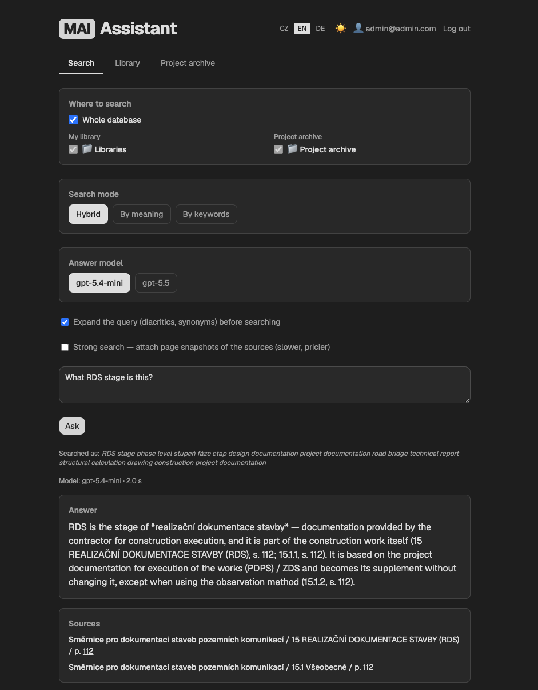
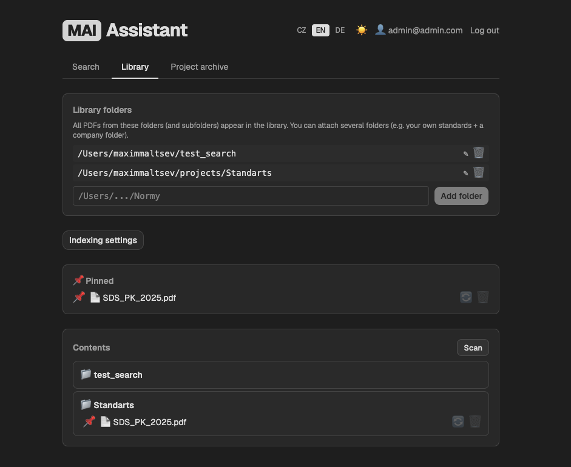
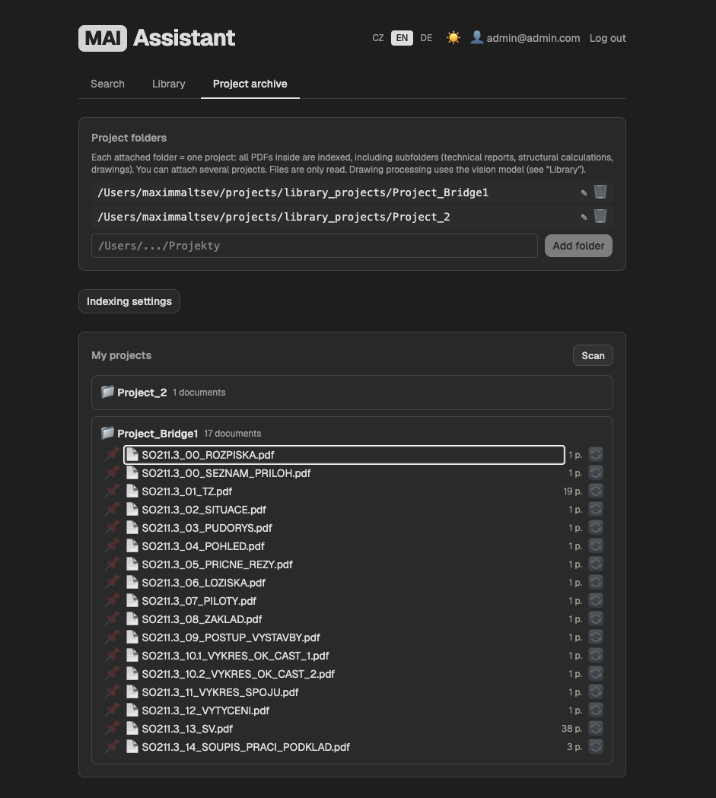

# MAI Assistant

[English](README.md) | [Čeština](README.cs.md) | **Deutsch**

Stellen Sie Fragen zu Baunormen in normaler Sprache — Sie erhalten eine
kurze Antwort mit Verweis auf das genaue Dokument, den Abschnitt und die
Seite. Schluss mit dem Blättern durch 300-Seiten-PDFs.

Eine lokale Desktop-App für Bauingenieure, die mit ČSN, Eurocodes und
eigenen Projektarchiven arbeiten. Der Autor ist Brückeningenieur; die App
wird täglich in einem echten Ingenieurbüro eingesetzt.

**Ihre Dokumente verlassen Ihren Rechner nie.** Index und Datenbank
laufen lokal; es gibt keinen Cloud-Speicher, und niemand — auch nicht der
Autor — sieht Ihre Dateien oder Fragen. Der einzige ausgehende Verkehr
sind OpenAI-API-Aufrufe mit Ihrem eigenen Schlüssel.

## Funktionen

- **Fragen in beliebiger Sprache** — die Antwort zitiert die Quelle und
  verlinkt direkt auf die Seite im Original-PDF.
- **Hybride Suche** — exakte Codes („ČSN 73 6201“) und Bedeutung.
- **Versteht Zeichnungen** — OCR + Vision-Modell beschreiben jedes Blatt
  (was gezeichnet ist, Leistungsphase, Objekt).
- **Projektarchiv** — durchsuchen Sie Ihre abgeschlossenen Projekte
  (Berichte, statische Berechnungen, Pläne) zusammen mit den Normen.
- **Gemeinsame Firmenbibliothek** — ein Kollege indexiert den
  Netzwerkordner, alle anderen übernehmen den fertigen Index kostenlos.
- **Starke Suche** — bei schweren Fragen zu Zeichnungen und Tabellen
  erhält das antwortende Modell zusätzlich Seitenabbilder.
- **3 Oberflächensprachen** (EN/CS/DE) + separate Antwortsprache.
- **Lokal** — Index, Datenbank und Dokumente bleiben auf Ihrem Rechner.

## OpenAI-API-Schlüssel

Die App läuft mit Ihrem eigenen OpenAI-Schlüssel — Sie zahlen direkt an
OpenAI, die App berechnet nichts zusätzlich.

1. Konto anlegen auf [platform.openai.com](https://platform.openai.com).
2. **Billing → Add credits** — einen kleinen Betrag aufladen (schon $5
   reichen lange).
3. **API keys → Create new secret key** — den `sk-…`-Schlüssel kopieren.
4. In der App unter **Einstellungen → OpenAI-Schlüssel** einfügen. Er
   wird nur auf Ihrem Computer gespeichert.

Gemessene Kosten mit dem Standardmodell:

| Aktion | Kosten |
|---|---|
| Textnorm indexieren | ~$0.04 pro Seite mit Schemata, reiner Text weniger |
| Zeichnung indexieren | < $0.01 pro Blatt |
| Eine Frage | < $0.01 |
| Frage mit starker Suche | ~$0.04 |

## Datenschutz und Telemetrie

- Dokumente, Index und Datenbank verlassen Ihren Rechner nie.
  Textauszüge und Seitenbilder gehen ausschließlich an die **OpenAI-API**
  über Ihren Schlüssel.
- Eine kostenlose Registrierung ist erforderlich; die App sendet
  **anonyme Telemetrie** (Ereigniszähler, Zeiten, Kosten, Fehlertypen —
  nie Fragetexte oder Dateinamen).
- Ein nicht erreichbarer Lizenzserver blockiert die App nie.
- Die öffentliche Version indexiert bis zu **3000 Seiten**
  (RAM-Sicherheitslimit).

## Status

Pilotbetrieb in einem Brückenbau-Ingenieurbüro (Tschechien) mit echten
Normen und Projekten. Die kostenlose öffentliche Windows-Version ist in
Vorbereitung.

Technische Details (Architektur, Start aus dem Quellcode):
[englisches README](README.md).

## Lizenz

[PolyForm Noncommercial 1.0.0](LICENSE.md) — für nichtkommerzielle
Nutzung frei; kommerzielle Rechte verbleiben beim Autor.
